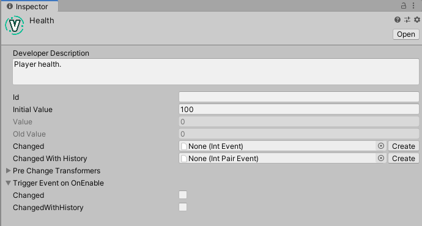
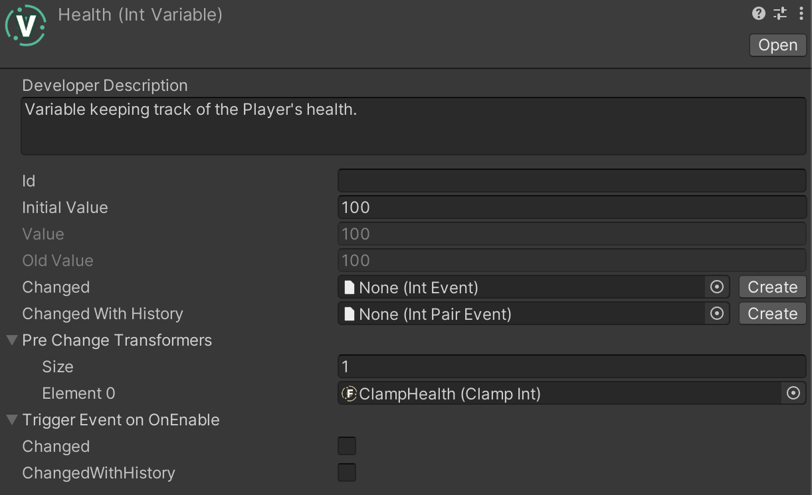
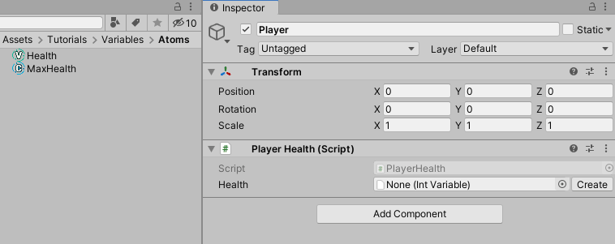
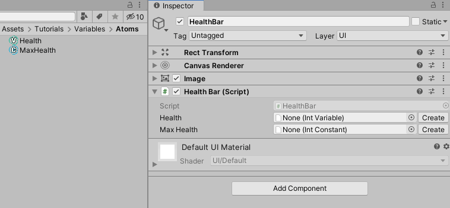
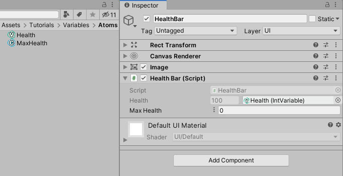

# Variables, Constants, and References

Below follows a step-by-step example of managing a player's health using Unity Atoms. If you haven't read the [Creating Atoms](./creating-atoms.md) and [Overview](../introduction/overview.md) section you should do that before proceeding.

_NOTE: This tutorial is based on [this](https://medium.com/@adamramberg/unity-atoms-tiny-modular-pieces-utilizing-the-power-of-scriptable-objects-e8add1b95201) blog post. The blog post is based on a previous version of Unity Atoms and as such will vary in content and appearance. The ideas presented by the blog post still apply._ 

## Decouple your scripts using Variables and Constants

Variables are storing data, for example primitives, reference types or structs as Scriptable Objects. Because Variables are stored as Scriptable Objects they are not part of any scene, but could instead be seen as part of the game’s global shared state. Variables are designed to make it easy to inject them (via the Unity Inspector) and share them between your MonoBehaviours. A Constant is a trimmed down version of a Variable and it's value can't be altered at runtime. Lets see an example on how to use Variables and Constants!

Imagine you have a `PlayerHealth.cs` script that contains the health of the game’s player. We will attach the script to a `GameObject` with a `SpriteRenderer`, `BoxCollider2D` and a `Rigidbody2D` called Player. The health is represented by an `int`, which corresponds to an `IntVariable` in Unity Atoms. The script will look like this:

```cs
using UnityEngine;
using UnityAtoms.BaseAtoms;

public class PlayerHealth : MonoBehaviour
{
    public IntVariable Health;
}
```

In the game the player’s health will decrease when hitting something harmful. We will attach this `Harmful.cs` script to a GameObject called Harmful that also has a `SpriteRenderer` and a `BoxCollider2D` (as a trigger):

```cs
using UnityEngine;

public class Harmful : MonoBehaviour
{
    void OnTriggerEnter2D(Collider2D collider)
    {
        if (collider.tag == "Player")
        {
            collider.GetComponent<PlayerHealth>().Health.Value -= 10;
        }
    }
}
```

This script is added as an example of what might influence the value of the player's health during gameplay. It will be referenced in a later tutorial.

## Creating a simple health bar

Finally we will add an UI `HealthBar.cs` script that we attach to a `GameObject` (inside a UI Canvas) with a `RectTransforn`, `CanvasRenderer` and UI `Image` component. The `HealthBar.cs` script will update the `Image` representing the health bar when the player’s health is changing:

```cs
using UnityEngine;
using UnityEngine.UI;
using UnityAtoms.BaseAtoms;

public class HealthBar : MonoBehaviour
{
    [SerializeField]
    private IntVariable Health;
    [SerializeField]
    private IntConstant MaxHealth;

    void Update()
    {
        GetComponent<Image>().fillAmount = 1.0f * Health.Value / MaxHealth.Value;
    }
}
```

## Adding Atoms

Go ahead and create an `IntVariable` called `Health` and an `IntConstant` called `MaxHealth`. `MaxHealth` is an `IntConstant` since it will not be changed during runtime. Set the initial value and value to 100, respectively.

To create these `.asset` files, see [Creating Atoms](./creating-atoms.md). They are both global assets stored as `.asset` files that could be shared between scripts.

The Variable Atom looks like this in the Unity Inspector:



And the Constant Atom looks like this:


The `Developer Description` is a text describing the Variable in order to document it, the `Value` is the actual value of the Variable, and `Old Value` is the last value the Variable had after it was changed via code. 

`Changed` and `Changed With History` are explained in the [Events](./events.md) tutorial.

## Clamp health changes

Before we continue we can create a pre change transformer to clamp the `Health` between 0 and the value of `MaxHealth`. Go ahead and create an `ClampInt` function and rename it `ClampHealth`. Set min to 0 and max to `MaxHealth`. 


Add it as a pre change transformer to the `Health` variable:



The value of `Health` will now be clamped between 0 and the value of `MaxHealth`.

## Assigning Atoms

Atoms can be assigned using the Unity Inspector. Assign the Atoms on the `PlayerHealth`  like this:



and `HealthBar` like this:



Variables give us a way of separating our game’s shared state from the actual implementation. It also makes our code less coupled since we do not need to reference other MonoBehaviours in our scripts, e.g. we do not need to reference the `PlayerHealth.cs` script in our `HealthBar.cs` script like this:

```cs
[SerializeField]
private PlayerHealth playerHealth; // Code would become coupled with PlayerHealth
```

## Introduce flexibility using References

For more flexibility in your code, you may also choose to use `IntReference` instead of `IntVariable` or `IntConstant`. 

In the previous example, change the type of `MaxHealth` to `IntReference`:

```cs
[SerializeField]
private IntReference MaxHealth;
```

Now you have more options for the variable in the inspector:



## Conclusion

At first glance the scipts here do not seem to work. The health bar stays at the same value even if the value of the `Health` Atom changes. This tutorial is primarily about decoupling scripts. To have the health bar function as expected, events and listeners are needed. These are both introduced in later tutorials. 

Hurray for less coupled code! 🎉
